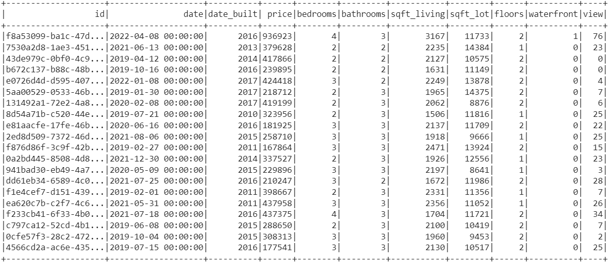

# Home_Sales
## Module 22 Challenge
In this challenge, I used my knowledge of SparkSQL to determine key metrics about home sales data. I used Spark to create temporary views, partition the data, cache and uncache a temporary table, and verify that the table has been uncached.

## ??
To begin this assignment, I read in the data for this project using an s3 bucket from AWS. 

I then created a temporary view called home_sales to answer the following questions using SparkSQL.

- What is the average price for a four-bedroom house sold for each year? Round off your answer to two decimal places.

- What is the average price of a home for each year it was built that has three bedrooms and three bathrooms? Round off your answer to two decimal places.

- What is the average price of a home for each year that has three bedrooms, three bathrooms, two floors, and is greater than or equal to 2,000 square feet? Round off your answer to two decimal places.

- What is the "view" rating for homes costing more than or equal to $350,000? Determine the run time for this query, and round off your answer to two decimal places.

I then cached the temporary table and ran the same query, comparing the runtime to the uncached runtime.

Then, I partitioned the data by the date_built field on the formatted pqarquet home sales data. I created a temporary table for the parquet data and ran the query to compare it to the uncached runtime.

## References
Data for this dataset was generated by edX Boot Camps LLC, and is intended for educational purposes only.